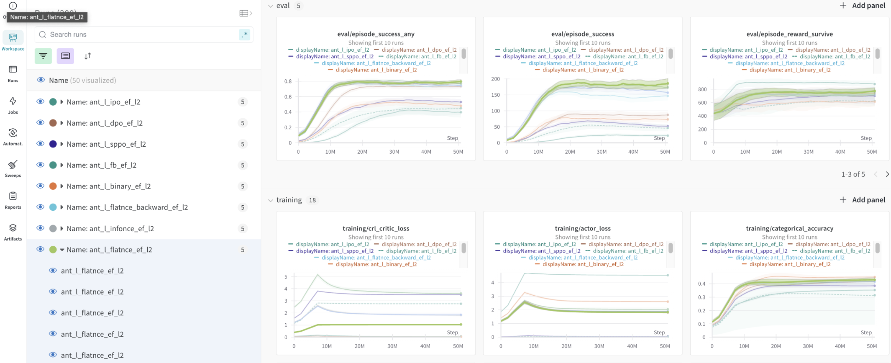

<h1 align="center"> Consistent Zero-Shot Imitation with Contrastive Goal Inference (CIRL)</h1>

[**Installation**](#Installation) | [**Quick Start**](#start) | [**Environments**](#envs) | [**Baselines**](#baselines) | [**Citation**](#cite)


We investigate whether purely self-directed exploration & task execution enable an agent to instantly imitate new behaviors. During training, our agent proposes and practices reaching its own goals in a multi-task environment, and at test time must imitate a demonstration zero-shot, with low regret.

This repo is built on top of [JaxGCRL](https://github.com/MichalBortkiewicz/JaxGCRL). 

## Installation 📂
The environment can be set up from the `environment.yml` file.
```bash
conda env create -f environment.yml
```

<h3 name="start" id="start">Quick Start 🚀 </h3>

To verify the installation, run a test experiment using the `./scripts/train.sh` file:

```bash
chmod +x ./scripts/train.sh; ./scripts/train.sh
```
> [!NOTE]  
> If you haven't yet configured [`wandb`](https://wandb.ai/site), you may be prompted to log in.

Specific configs can be specified as in `scripts/train.sh`. The descriptions of the available flags are in `utils.py:create_parser()`. Common flags you may want to change include:
- **env=...**: replace "ant" with any environment name. See `utils.py:create_env()` for names.
- Removing **--log_wandb**: omits logging, if you don't want to use a wandb account.
- **--num_timesteps**: shorter or longer runs.
- **--num_envs**: based on how many environments your GPU memory allows.
- **--contrastive_loss_fn, --energy_fn, --h_dim, --n_hidden, etc.**: algorithmic and architectural changes.

### Environment Interaction

Environments can be controlled with the `reset` and `step` functions. These methods return a state object, which is a dataclass containing the following fields:

`state.pipeline_state`: current, internal state of the environment\
`state.obs`: current observation\
`state.done`: flag indicating if the agent reached the goal\
`state.metrics`: agent performance metrics\
`state.info`: additional info

The following code demonstrates how to interact with the environment:

```python
import jax
from utils import create_env

key = jax.random.PRNGKey(0)

# Initialize the environment
env = create_env('ant')

# Use JIT compilation to make environment's reset and step functions execute faster
jit_env_reset = jax.jit(env.reset)
jit_env_step = jax.jit(env.step)

NUM_STEPS = 1000

# Reset the environment and obtain the initial state
state = jit_env_reset(key)

# Simulate the environment for a fixed number of steps
for _ in range(NUM_STEPS):
    # Generate a random action
    key, key_act = jax.random.split(key, 2)
    random_action = jax.random.uniform(key_act, shape=(8,), minval=-1, maxval=1)
    
    # Perform an environment step with the generated action
    state = jit_env_step(state, random_action)
```

### Wandb support 📈
We strongly recommend using Wandb for tracking and visualizing results ([Wandb support](##wandb-support)). Enable Wandb logging with the `--log_wandb` flag. The following flags are also available to organize experiments:
- `--project_name`
- `--group_name`
- `--exp_name`

The `--log_wandb` flag logs metrics to Wandb. By default, metrics are logged to a CSV.

1. Run example [`sweep`](https://docs.wandb.ai/guides/sweeps):
```bash
wandb sweep --project exemplary_sweep ./scripts/sweep.yml
```
2. Then run `wandb agent` with :
```
wandb agent <previous_command_output>
```

We also render videos of the learned policies as `wandb` artifacts. 

<p align="center">
  
   
</p>

<h2 name="envs" id="envs">Environments 🌎</h2>

We currently support a variety of continuous control environments:
- Locomotion: Half-Cheetah, Ant, Humanoid
- Simple arm: Reacher, Pusher


| Environment     | Env name                                                                 | Code                                              |
| :-------------- | :----------------------------------------------------------------------: | :-----------------------------------------------: |
| Reacher         | `reacher`                                                                | [link](./envs/reacher.py)                         |              |
| Pusher          | `pusher_easy` <br> `pusher_hard`                                         | [link](./envs/pusher.py)                          |
| Ant             | `ant`                                                                    | [link](./envs/ant.py)                             |
| Point Maze        | `simple_u_maze` <br> `simple_big_maze` <br> `simple_hardest_maze`                 | [link](./envs/simple_maze.py)                        |

To add new environments: add an XML to `envs/assets`, add a python environment file in `envs`, and register the environment name in `utils.py`.

<h2 name="baselines" id="baselines">Baselines 🤖</h2>

We currently support following algorithms:

| Algorithm                                     | How to run                             | Code                                     |
|-----------------------------------------------|----------------------------------------|------------------------------------------|
| [CRL](https://arxiv.org/abs/2206.07568)       | `python training.py ...`               | [link](./src/train.py)                   |
| [PPO](https://arxiv.org/abs/1707.06347)       | `python training_ppo.py ...`           | [link](./src/baselines/ppo.py)           |
| [FB](https://arxiv.org/abs/2103.07945)       | `python training_fb.py ...`           | [link](./src/train_fb.py)           |
| [HILP](https://arxiv.org/abs/2402.15567)       | `python training_hilp.py ...`           | [link](./src/train_hilp.py)           |


## Code Structure 📝

The core structure of the codebase is as follows:

<pre><code>
├── <b>src:</b> Algorithm code (training, network, replay buffer, etc.)
│   ├── <b>train.py:</b> Main file. Defines energy functions + losses, and networks. Collects trajectories, trains networks, runs evaluations.
│   ├── <b>replay_buffer.py:</b> Contains replay buffer, including logic for state, action, and goal sampling for training.
│   └── <b>evaluator.py:</b> Runs evaluation and collects metrics.
├── <b>envs:</b> Environments (python files and XMLs)
│   ├── <b>ant.py, humanoid.py, ...:</b> Most environments are here.
│   ├── <b>assets:</b> Contains XMLs for environments.
│   └── <b>manipulation:</b> Contains all manipulation environments.
├── <b>scripts/train.sh:</b> Modify to choose environment and hyperparameters.
├── <b>utils.py:</b> Logic for script argument processing, rendering, environment names, etc.
└── <b>training.py:</b> Interface file that processes script arguments, calls train.py, initializes wandb, etc.
</code></pre>

The architecture can be adjusted in `networks.py`.


<h2 name="cite" id="cite">Citing CIRL 📜 </h2>
If you use CIRL in your work, please cite us as follows:

```bibtex
@inproceedings{wantlin2026cirl,
    title={Consistent Zero-Shot Imitation with Contrastive Goal Inference},
    author={Wantlin, Kathryn and Zheng, Chongyi and Eysenbach, Benjamin},
    booktitle={Proceedings of the International Conference on Machine Learning (ICML)},
    url={https://arxiv.org/abs/2510.17059},
    year={2026}
}
```

## Questions ❓
If you have any questions, comments, or suggestions, please reach out to Kathryn Wantlin ([kw2960@princeton.edu](kw2960@princeton.edu)).
